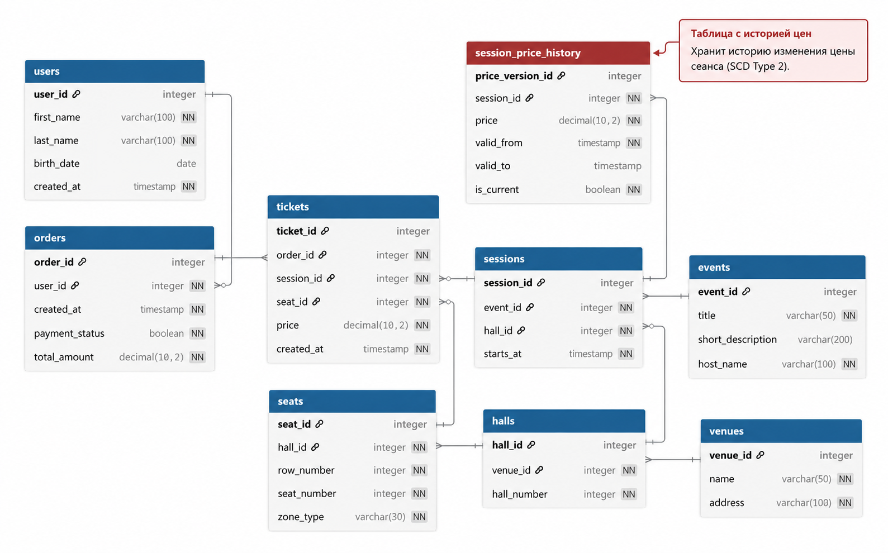

# Сервис продажи билетов - база данных

## О проекте

Проект представляет собой базу данных сервиса продажи билетов на мероприятия.

Одно мероприятие может иметь несколько сеансов. Каждый сеанс проходит в определённом зале, зал относится к площадке, а в зале находятся фиксированные места. Пользователь может оформить заказ, включающий один или несколько билетов.

В проекте используется **PostgreSQL**.

Основные сущности:

- `users` - пользователи;
- `orders` - заказы;
- `tickets` - билеты;
- `events` - мероприятия;
- `sessions` - сеансы;
- `venues` - площадки;
- `halls` - залы;
- `seats` - места;
- `session_price_history` - история изменения цены сеанса.

Для хранения истории изменения цены используется **SCD Type 2**.

---


## Физическая модель



Подробное описание таблиц, атрибутов, типов данных и ограничений находится в файле [`docs/physical-model.md`](docs/physical-model.md).

---

## Основные ограничения

В схеме предусмотрены ограничения, обеспечивающие целостность данных:

- одно место нельзя продать дважды на один и тот же сеанс: `UNIQUE (session_id, seat_id)`;
- номер места уникален внутри зала: `UNIQUE (hall_id, row_number, seat_number)`;
- номер зала уникален внутри площадки: `UNIQUE (venue_id, hall_number)`;
- стоимость билета и заказа должна быть положительной;
- номера рядов, мест и залов должны быть положительными;
- для одного сеанса может существовать только одна текущая версия цены;
- для версионных данных `valid_to` должен быть позже `valid_from`.

---

## Сценарии использования

База данных позволяет:

- хранить пользователей сервиса;
- хранить площадки, залы и места;
- создавать мероприятия и сеансы;
- хранить текущую и историческую стоимость сеансов;
- оформлять заказы;
- хранить билеты, входящие в заказ;
- получать данные о продажах и выручке;
- анализировать пользователей, мероприятия, заказы и билеты с помощью SQL-запросов.

---

## Структура проекта

```text
.
├── README.md
├── docs/
│   ├── conceptual_model.png
│   ├── logical_model.png
│   ├── physical_model.png
│   └── physical-model.md
└── scripts/
    ├── create_tables.sql
    ├── create_data.sql
    ├── 1.sql
    ├── 2.sql
    ├── ...
    └── 15.sql
```

---

## Как запустить проект

### 1. Создать базу данных PostgreSQL

Создайте пустую базу данных PostgreSQL и подключитесь к ней.

### 2. Создать таблицы

Запустить:

```text
scripts/create_tables.sql
```

Скрипт создаёт таблицы, первичные и внешние ключи, ограничения и необходимые уникальные индексы.

### 3. Заполнить базу тестовыми данными

Запустите:

```text
scripts/create_data.sql
```

Скрипт заполняет таблицы данными.
(Данные для заполнения сгенерированны ИИ)

### 4. Выполнить аналитические запросы

После заполнения базы можно последовательно запускать файлы:

```text
scripts/1.sql
...
scripts/15.sql
```

---

## SQL-запросы

В проекте реализовано 15 простых запросов, покрывающих базовые конструкции SQL.
Информация о том, что делает каждый запрос записана в каждом файле в виде комментария.


## Как проверить проект

Рекомендуемый порядок проверки:

1. Создать пустую базу PostgreSQL.
2. Выполнить `scripts/create_tables.sql`.
3. Выполнить `scripts/create_data.sql`.
4. Убедиться, что таблицы заполнены данными.
5. Выполнить запросы `1.sql` - `15.sql` в любом порядке

## Где можно использовать

Схема может быть использована как основа для сервиса продажи билетов для
- кинотеатров
- театров
- концертов

## Нормализация

Логическая модель приведена к 3НФ: атрибуты таблиц зависят от первичных ключей и не содержат транзитивных зависимостей. Все данные разделены между самостоятельными сущностями.

## Версионирование

Для истории изменения цены используется SCD Type 2. При изменении цены старая запись сохраняется с датой окончания действия, а новая версия добавляется отдельной строкой.
